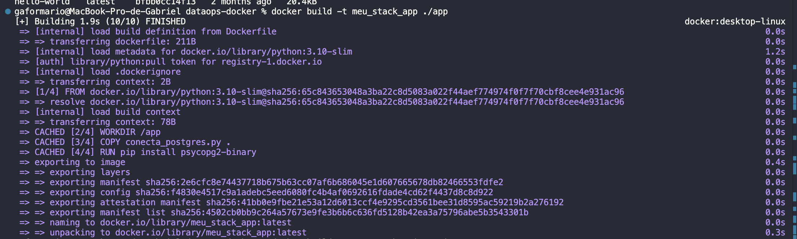
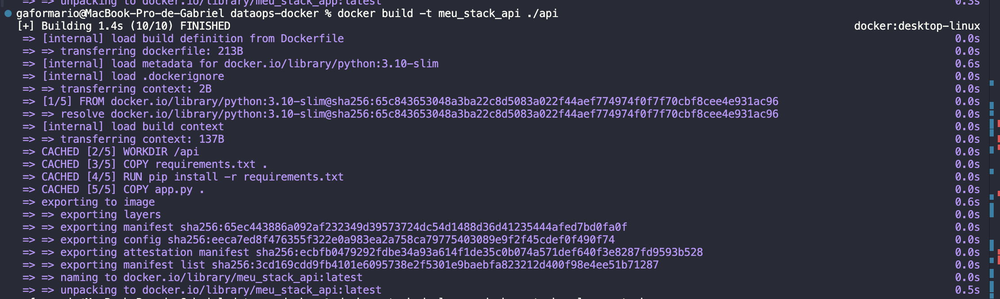
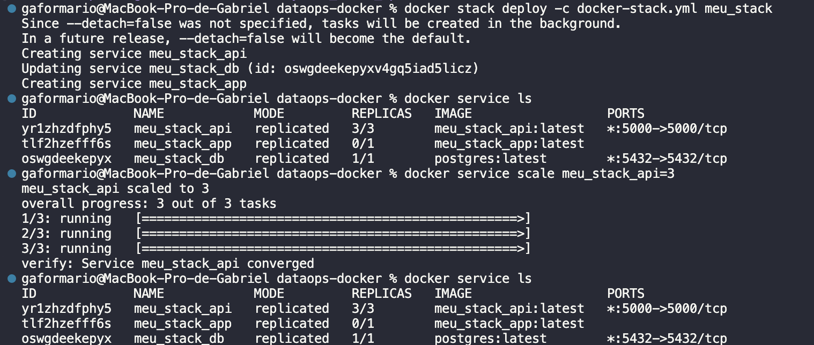

# DataOps - Atividade II

Este repositório contém uma configuração de ambiente Docker para uma aplicação composta por uma API e um banco de dados PostgreSQL. O objetivo é demonstrar como usar o Docker Swarm para orquestrar serviços e escalar a aplicação.

## Estrutura do Projeto

- **db**: Serviço de banco de dados PostgreSQL.
- **app**: Serviço de aplicação (pode ser um backend ou frontend).
- **api**: Serviço de API, configurado para escalar com múltiplas réplicas.

## Pré-requisitos

Antes de começar, certifique-se de ter os seguintes itens instalados:

- [Docker](https://www.docker.com/)
- [Git](https://git-scm.com/)

## Configuração do Projeto

1. Clone este repositório:

   ```bash
   git clone https://github.com/gaformario/dataops-docker.git
   cd dataops-docker

2. Construa as imagens Docker para os serviços `app` e `api`:

   ```bash
   docker build -t meu_stack_app ./app
   docker build -t meu_stack_api ./api





3. Inicie o Docker Swarm (caso ainda não esteja ativo):

    ```bash
    docker swarm init

4. Implante a stack no Docker Swarm
    ```bash 
    docker stack deploy -c docker-stack.yml meu_stack

5. Agora para testar se funcionou corretamente, teste o **endpoint** abaixo:
    ```bash
    curl http://localhost:5000/endpoint

- Caso retorne algo assim como a resposta abaixo, é porque funcionou:
    ```bash
    [[1,"Alice"],[2,"Bob"]

6. Para escalar o serviço da API:
    ```bash
    docker service scale meu_stack_api=3



